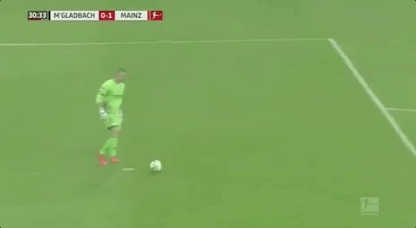
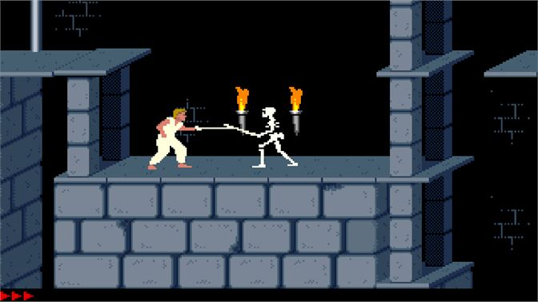
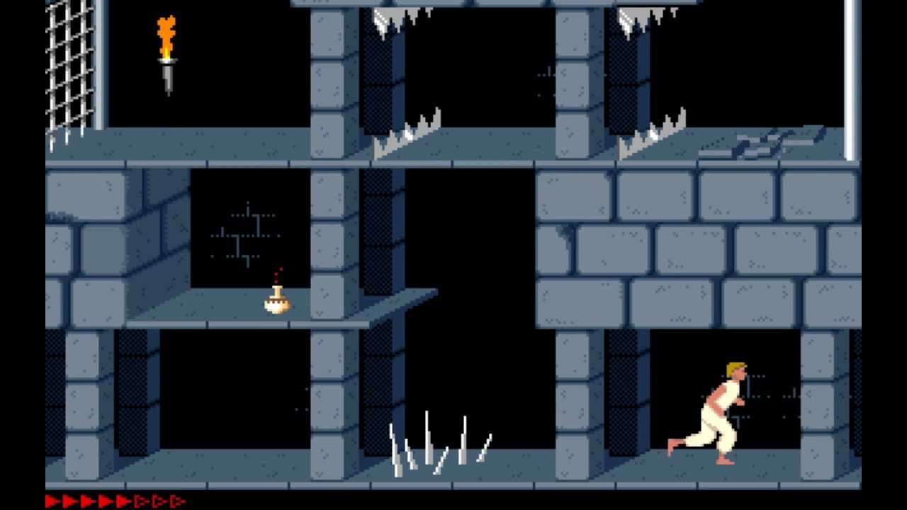
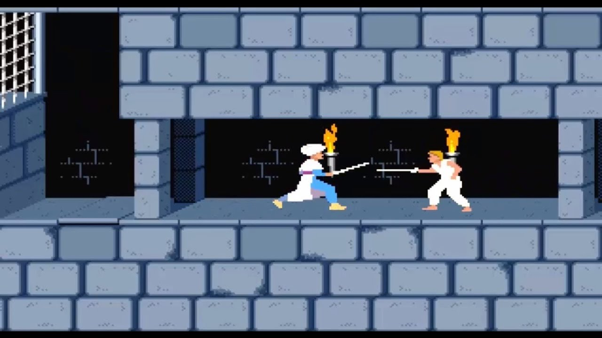
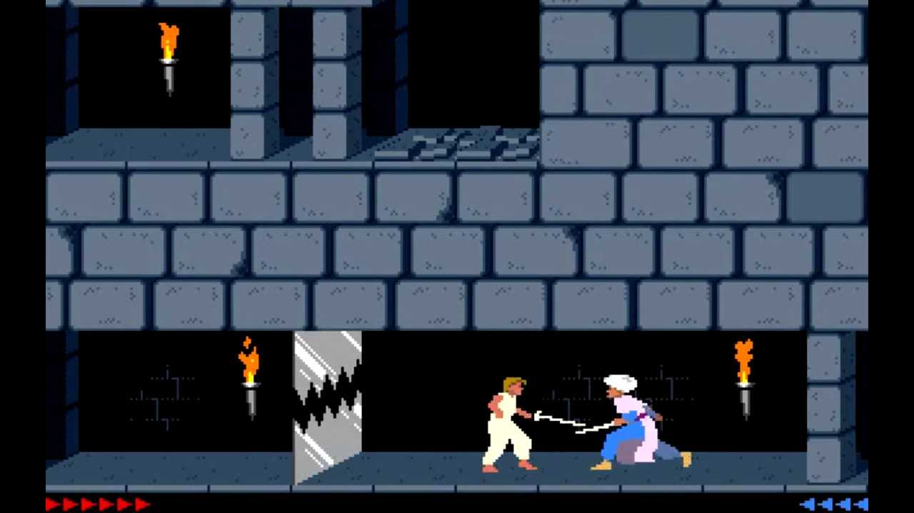
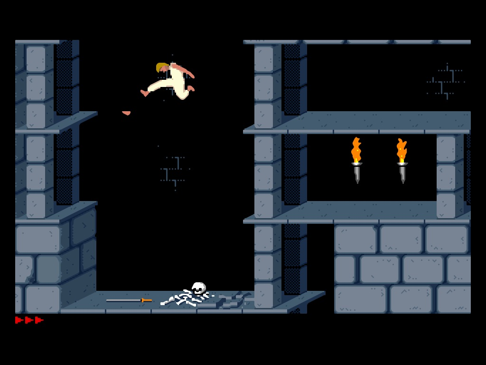
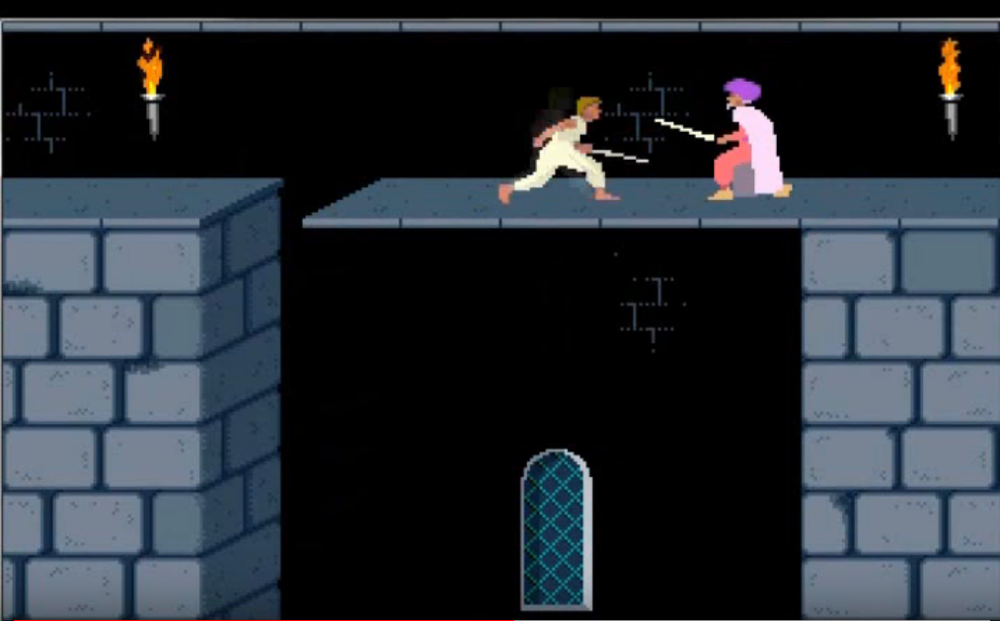
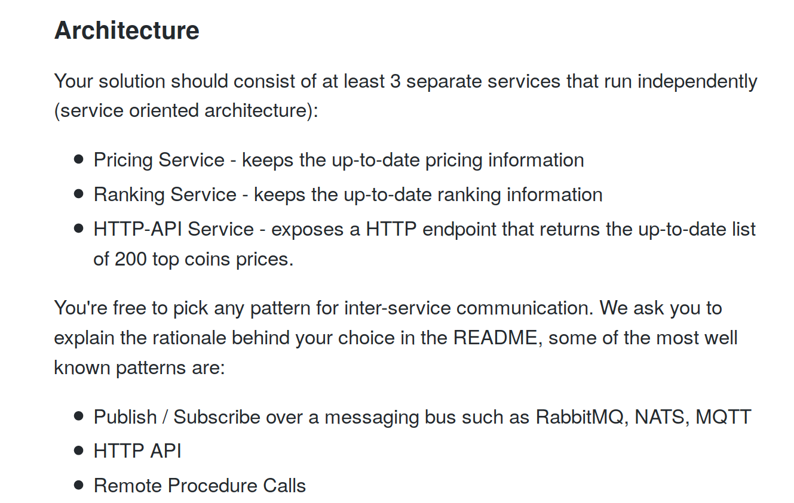

<section
  data-background-image="img/ski.jpg"
  style='min-height=50% important!'>
.
  </section>

::::
<!-- obrazek ze przegranym naciarzem -->
<section
  data-background-image="img/przegrani-polacy2.jpg"
  style='min-height=50% important!'>
.
  </section>

::::

# #1
# Nawet jeśli wszystko jest OK,
# mogę zostać zwolniony

::::

# 5 rzeczy, które nauczyłem się (znowu) szukając pracy
### i jedna naprawdę ważna, którą zrozumiałem później

::::

 </img>

::::
<section
  data-background-image="img/goalie-missing.jpg"
  style='min-height=50% important!'>
</section>

::::

# #2
# Co zrobię jeśli nie będzie pracy, której szukam?

::::

# Przygotowania

::::
<section
  data-background-image="img/sztanga.jpg"
  style='min-height=50% important!'>
</section>

::::
<section
  data-background-image="img/asekuracja.jpg"
  style='min-height=50% important!'>
</section>

::::
<section
  data-background-image="img/barca.jpeg"
  style='min-height=50% important!'>
</section>

<!-- pomocnik przy treningu -->
::::
# #3
# Najskuteczniejszy jest networking

::::

# Proces rekrutacji

::::

</img>
</img>
</img>
</img>
</img>
</img>

::::

<section
  data-background-image="img/prince-fight2.jpg"
  style='min-height=50% important!'>
</section>

::::

<section
  data-background-image="img/prince-obstacles.jpg"
  style='min-height=50% important!'>
</section>

::::
 </img>

::::

::::

<section
  data-background-image="img/prince-dead.jpg"
  style='min-height=50% important!'>
</section>

::::

## 23 próby
* 9 nieudanych
* 4 odrzucone
* 7 timeoutów
* 1 udana

::::

<section
  data-background-image="img/witcher.jpg"
  style='min-height=50% important!'>
</section>

::::

# #4
# Opowiadaj o tym,
# co najważniejsze

::::

# Negocjacje

::::

<section
  data-background-image="img/kitten-poker-open.jpg"
  style='min-height=50% important!'>
</section>

::::

<section
  data-background-image="img/texas-holdem.jpg"
  style='min-height=50% important!'>
</section>

::::

# #5
# Kto ma wiedzę,
# ten ma przewagę

::::

<section
  data-background-image="img/siatkarze.jpg"
  style='min-height=50% important!'>
</section>

::::

<section
  data-background-image="img/big-catan.jpg"
  style='min-height=50% important!'>
</section>

::::

# #0
# Rekrutacja nie jest grą o sumie zerowej

::::

<section
  data-background-image="img/wspin.jpg"
  style='min-height=50% important!'>
</section>

::::

## Do dyskusji

<ul>
<li class='fragment'> Jakie przygotowania były dla Was pomocne podczas rekrutacji? </li>
<li class='fragment'> Jakie zadania najlepiej sprawdzają umiejętności techniczne kandydata? </li>
<li class='fragment'> Jakie pytania pokazują jego umiejętności miękkie? </li>
<li class='fragment'> Ile czasu jesteście skłonni poświęcić na rekrutację? </li>
<li class='fragment'> Jakie najgłupsze pytanie usłyszeliście na rekrutacji? </li>
<li class='fragment'> Jak chcielibyście się rekrutować? Co chcielibyście widzieć na początku? </li>

</ul>
