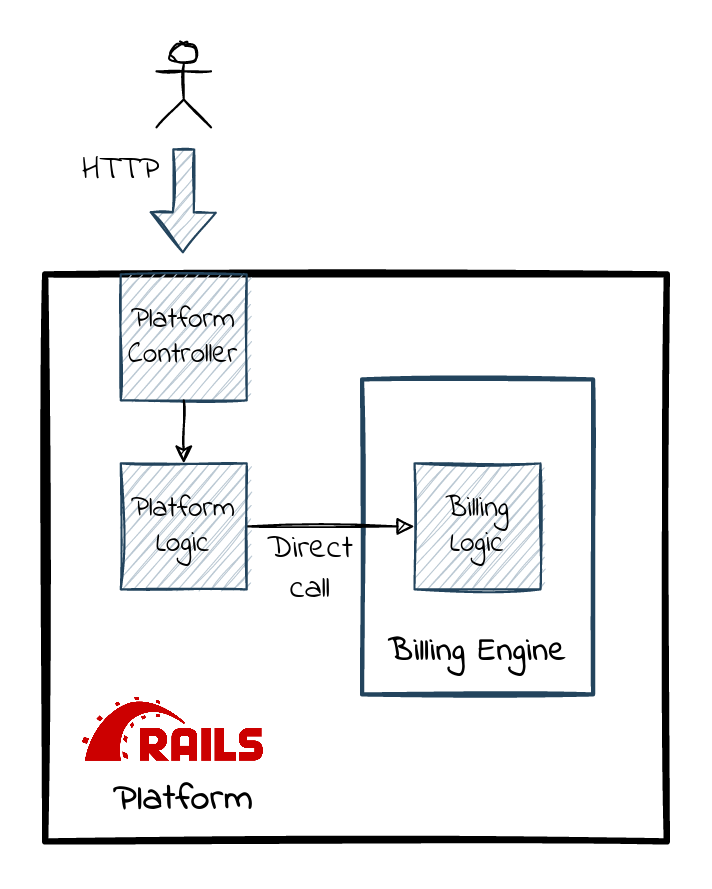
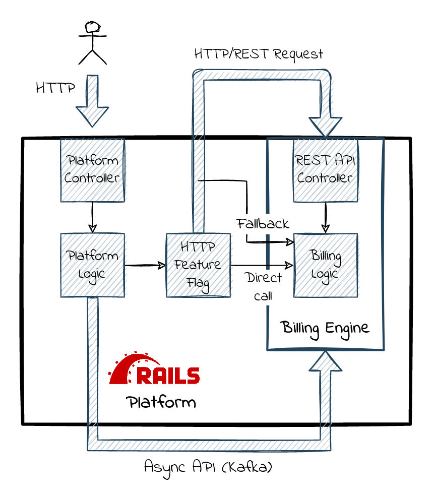
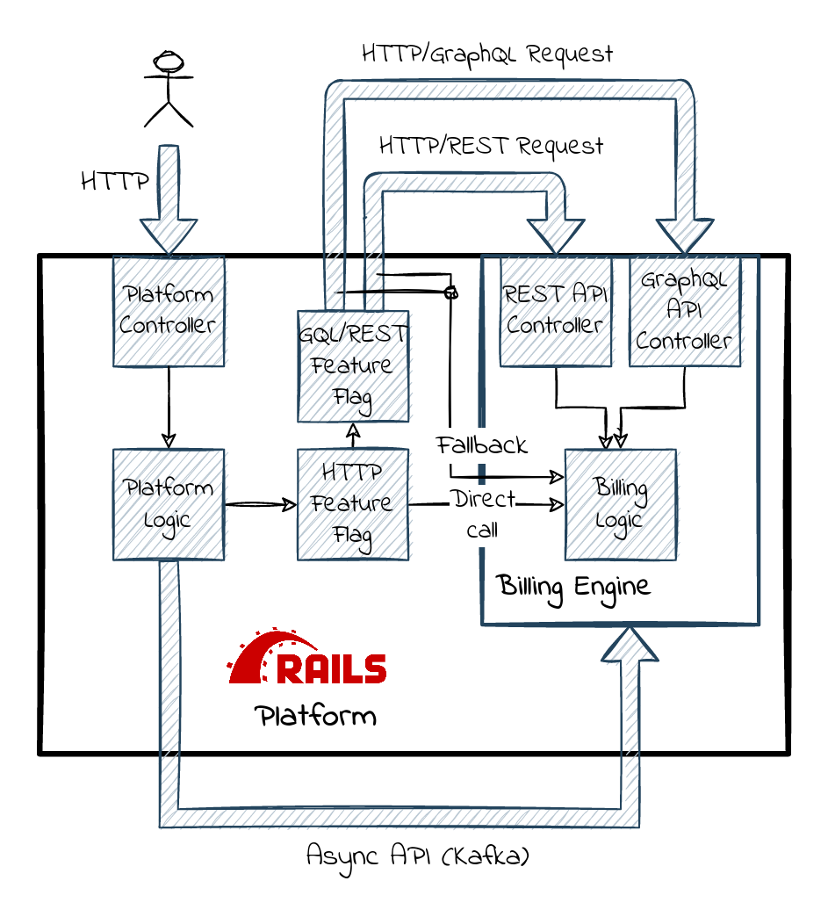
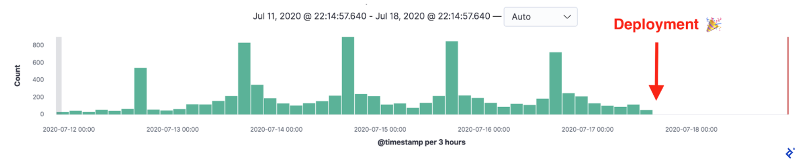
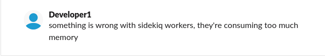
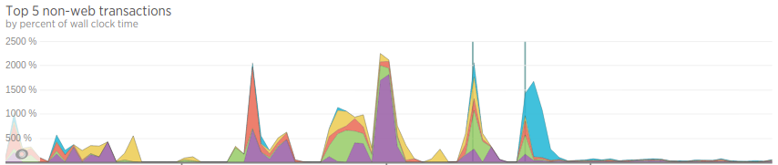
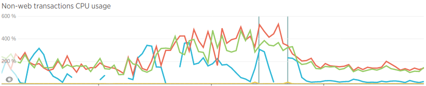
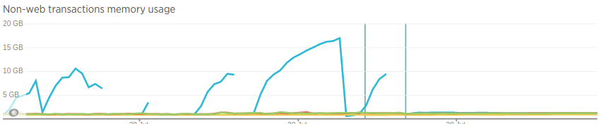
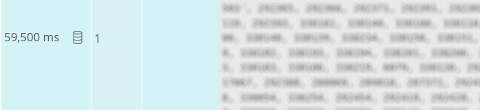
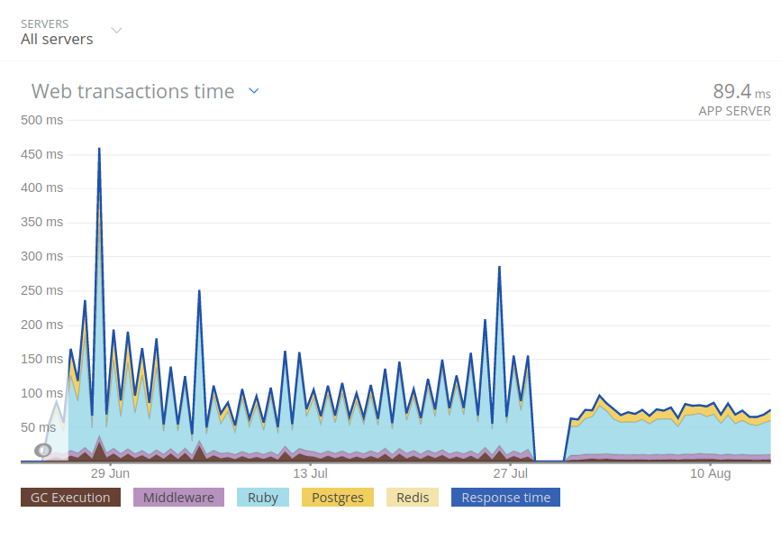

<section
  data-background-image="img/wrench-nadia.jpg"
  style='min-height=120% important!'
/>

::::

<section
  data-background-image="img/wrench-nadia.jpg"
  style='min-height=120% important!'
>
  <div class='image-overlay title'>
    <h2 class='subtitle'> API Optimisation Tale: </h2>
    <h1 style="font-size:130px">
      Monitor, Fix and&nbsp;Deploy <br />
      <span class='problem'>(on Friday)</span>
    </h1>
    <hr>
    <h2> Maciek Rząsa &nbsp;&middot; &nbsp;Chattermill </h2>
    <h2>  <a href='https://twitter.com/mjrzasa'>@mjrzasa</a> </h2>
    <br />
    <br />

    <small style="font-size:20px"> Photo by <a href="https://pixabay.com/pl/users/padrinan-1694659/?utm_source=link-attribution&amp;utm_medium=referral&amp;utm_campaign=image&amp;utm_content=4929711"> Miguel Á. Padriñán</a> from <a href="https://pixabay.com/pl//?utm_source=link-attribution&amp;utm_medium=referral&amp;utm_campaign=image&amp;utm_content=4929711"> Pixabay</a> </small>

    <small  style="font-size:10px; margin-left:1000px;">STpcsDG</small>
  </div>

</section>


::::

<section>
<h1 style='font-size:300px'> Friday  <span class='problem'>16:03 </span>  </h1>
</section>

::::

<section data-background-image="img/cat-scared-cropped.jpg">

<small style='margin-top:1000px; margin-right:1200px;'>Photo by <a href="https://unsplash.com/@snowboardinec?utm_source=unsplash&utm_medium=referral&utm_content=creditCopyText">Max Baskakov</a> on <a href="/?utm_source=unsplash&utm_medium=referral&utm_content=creditCopyText">Unsplash</a> </small>

</section>

::::


<section
  data-background-image="img/books.png"
  style='min-height=100% important!'
>

</section>

::::

<section
  data-background-image="img/witcher.jpg"
  style='min-height=100% important!'
>

<small style='margin-bottom:1300px; margin-left:1400px;'> &copy; Photo by Natalia Rząsa </small>
</section>

::::

<section
  data-background-image="img/wspin.jpg"
  style='min-height=100% important!'
>

<small style='margin-bottom:1300px; margin-left:1400px;'> &copy; Photo by Natalia Rząsa </small>
</section>

::::

<section
  data-background-image="img/bieszczady.png"
  style='min-height=100% important!'
>

<small style='margin-top:1300px; margin-right:1400px;'> &copy; Photo by Natalia Rząsa </small>
</section>


::::

<section
  data-background-image="img/kids.jpg"
  style='min-height=100% important!'
>

<small style='margin-bottom:1300px; margin-left:1400px;'> &copy; Photo by Natalia Rząsa </small>

</section>

::::
<section
  data-background-image="img/cat-parcel.jpg"
  style='min-height=100% important!'
>
<small style='margin-top:1000px; margin-right:1200px;'>Photo by <a href="https://unsplash.com/@glr0115?utm_content=creditCopyText&utm_medium=referral&utm_source=unsplash">乐融 高</a> on <a href="https://unsplash.com/photos/russian-blue-cat-in-brown-cardboard-box-jpiSpLoVZMs?utm_content=creditCopyText&utm_medium=referral&utm_source=unsplash">Unsplash</a></small>


</section>

::::

<section
  data-background-image="img/el-capitan.jpg"
  style='min-height=100% important!'>

<small style='margin-top:-1000px; margin-right:1200px;'> Image source: wikimedia.org </small>


</section>

::::

## Extraction


::::

## Extraction



:::

## Extraction

<div style='width: 50%; float: left'  >
<div></div>

#### From
```ruby
class Product < ApplicationRecord
  has_many :billing_records
end

class BillingRecord < ApplicationRecord
  belongs_to :product
end
```

</div>

<div style='width: 50%; float: left'>
<div></div>

#### To
```ruby
class Product < ApplicationRecord
  def billing_records
    @billing_records ||=
      ::Billing::QueryService
        .billing_records_for_products(self)
  end
end

class BillingRecord
  def product
    @product ||= Product.find(product_id)
  end
end
```
</div>

:::

## Extraction

<!--
image1 with architecture (platform calling billing directly or through REST)
Safe environment
* engine
* direct calls & HTTP calls
* feature flag, percentages
* fallback
-->



<!--
## Extraction

<div style='width: 50%; float: left'  >
<div></div>

#### From
```ruby
class Product < ApplicationRecord
  has_many :billing_records
end

class BillingRecord < ApplicationRecord
  belongs_to :product
end
```

</div>

<div style='width: 50%; float: left'>
<div></div>

#### To
```ruby
class Product < ApplicationRecord
  def billing_records
    @billing_records ||=
      ::Billing::QueryService
        .billing_records_for_products(self)
  end
end

class BillingRecord
  def product
    @product ||= Product.find(product_id)
  end
end
```
</div>
-->
:::

.
<div style='width: 30%; float: left'  >
<div></div>

## Monitor
wait for it

</div>
<div style='width: 40%; float: left'  >
<div></div>

## Fix: optimise
wait for it

</div>
<div style='width: 30%; float: left'  >
<div></div>

## Deploy
* CI checks
* easy & reliable rollback
* **safe env with a fallback**
* **feature flags**

<br />
<br />
<br />
<br />
<br />
<br />
</div>

:::


## Extraction: First attempt


<!--

## Extraction: First attempt


-->

<!--

First attempt
* replace AR associations with REST calls
* deduplicate & optimise REST calls
* epic failure (give the numbers)
-->

::::

## Extraction: GraphQL



<!--
Another attempt
* GQL
* step by step migration
* another layer of feature flags

In general OK, but some notable issues, mostly on the consumer side

but before we started the migration we added
-->

:::

## Extraction: Monitoring

<div style='width: 50%; float: left'>
<div></div>

* standard
  * errors (Rollbar/Sentry)
  * performance (NewRelic)
* **custom request instrumentation (Kibana)**
  * method name
  * arguments
  * stacktrace
  * response time (elapsed)
  * error
</div>

<div style='width: 50%; float: left'>
<div></div>

```JSON
{
"payload": {
  "method": "records_for_product",
  "arguments":
    "[[\"gid://platform/Product/12345\"]]",
  "stacktrace":
    "[
      \"app/models/product.rb:123\",
      \"app/services/sell_product.rb:43\"
     ]",
  "elapsed": 1.128494586795568,
  "error": null
  }
}

```
</div>

<!--
issues to detect
* `Billing Query Service GraphQL error: 429 Too Many Requests`
* multi-secon elapsed time
* slow response on new relic (check a single slow transaction)


<!--
* monitoring/instrumentation
  * source (stacktrace)
  * params

      maybe a screenshot from kibana?

plus ofc
  * errors
  * performance (response time)
that allowed us to track down the perf issues
-->

:::

.
<div style='width: 30%; float: left'  >
<div></div>

## Monitor
* standard stack (Rollbar/NewRelic)
* **custom request instrumentation**

</div>
<div style='width: 40%; float: left'  >
<div></div>

## Fix: optimise
wait for it

</div>
<div style='width: 30%; float: left'  >
<div></div>

## Deploy
* CI checks
* easy & reliable rollback
* safe env with a fallback
* feature flags

<br />
<br />
<br />
<br />
<br />
<br />
</div>

::::

<h1 style="font-size:250px"> optimise </h1>

::::

# Flood of requests

<br />

<h3 class='problem'> Problem: single view/job initiates <br /> many billing requests </h3>
### how many? Thousands!

:::

## Flood of requests

<div style='width: 50%; float: left'  >
<div></div>

#### Initial
```ruby
def perform(*)
  products = Product.eligible
  products.find_in_batches.each do |product|
    # one billing request per call
    DoBusinessLogic.call(product)
  end
end
```

<div class='fragment'>
<div></div>

```ruby
class DoBusinessLogic
  def call(product)
    product.billing_records.each {}
  end
end

class Product < ApplicationRecord
  def billing_records
    @billing_records ||=
      ::Billing::QueryService
       .billing_records_for_products(self)
  end
end
```
</div>


</div>

<div style='width: 50%; float: left'>
<div></div>

<div class='fragment'>
<div></div>

#### optimised
```ruby
def perform(*)
  products = Product.eligible
  products.find_in_batches do |batch|
    # one billing request per batch
    cache_billing_records(batch).each do |p|
      # no billing requests
      DoBusinessLogic.call(p)
    end
  end
end

def cache_billing_records(products)
  indexed_records =
    ::Billing::QueryService
      .billing_records_for_products(
        *products
      )
      .group_by(&:product_gid)

  products.each do |product|
    product.cache_billing_records!(
      indexed_records[product.gid].to_a
    )
  end
end
```
</div>

</div>

:::


<div style='width: 50%; float: left' class='full-height-image-background'>
<div></div>

</div>

<div style='width: 50%; float: left'  >
<div></div>

# Flood of requests?

<!--
Solution:
Preload data from DB and hash-join it with billing data
-->

<br>
<br>
<br>

<h1 class='solution'> Preload, cache, (hash-)join </h1>

<br/>
<small> &#9664; Ulf Michael Widenius, MySQL. Image source: wikipedia.org</small>

</div>


::::

# Frequently needed data
<br>
<h3 class='problem'> Problem: Single field was frequently used </h3>
### (~1k hits per day)

:::

## Frequently needed data

<!--
* Problem: frequently used field (~1k hits per day)
* First solution: build a read model based on kafka events
* Second solution: use local data!
> Use the domain, Luke!
-->

<div style='width: 52%; float: left' >
<div></div>

```ruby
# 1k billing hits per day
::Billing::QueryService
  .first_successful_record_created_at(client)
  &.in_time_zone&.to_date
```

#### Plan
* add field to kafka
* build a read model
* backfill the data
* start using the read model
* remove billing query

</div>

<div style='width: 48%; float: left' >
<div></div>

<div class='fragment' data-fragment-index=20>
<div></div>

```ruby
# one local DB query
client
  .products.successful
  .minimum(:start_date)
```

</div>
<div class='fragment' data-fragment-index=10>
<div></div>

#### Solution
* find that date in local DB
* verify if it's really the same date
* use it and remove billing query

</div>


</div>



:::

<div style='width: 50%; float: left' >
<div></div>

</div>

<div style='width: 50%; float: left' >
<div></div>

# Data needed frequently?

<!--
Solution:
Preload data from DB and hash-join it with billing data
-->

<br> <br>

<h1 class=solution> Use the domain, Luke! </h1>

<br />
<br />
<br />
<br />
<small> &#9664;  Image source: starwars.fandom.com </small>

</div>


::::

# Data flood
<br>
<h3 class='problem'>
Problem: generic queries <br> fetching all the data that might be needed
</h3>

:::

## Data flood

<div style='width: 50%; float: left' >
<div></div>

```ruby
# REST response
{
  "gid": "gid://..."
  "clientGid": "gid://..."
  "productGid": "gid://..."
  "availability": true
  "pending": false
  "frequency": "weekly"
  "startDate": "2020-08-21"
  "endDate": "2020-10-28"
  # ...
  # 36 fields total
  # loading 3-4 associations
}
```

```ruby
def billing_records_for_products(*products)
  fetch_billing_records(
    filter: {products: products}
  ).select(&:accessible?)
end
```

</div>

<div style='width: 50%; float: left' class='fragment' >
<div></div>

```
query($filter: RecordFilter!) {
  cycles(filter: $filter) {
    nodes {
      gid
      productGid
      pending
      frequency
    }
  }
}
```


```ruby
def billing_records_for_products(*products)
  fetch_billing_records(
    filter: {
      products: products,
      accessible: true
    }
  )
end
```

</div>

<!--And I deployed and waited, and... -->

::::

<section data-background-image="img/summer.jpg">

<small style='margin-top:1000px; margin-right:1200px;'>

Photo by <a href="https://unsplash.com/@ejleusink?utm_source=unsplash&utm_medium=referral&utm_content=creditCopyText">Erik-Jan Leusink</a> on <a href="https://unsplash.com/?utm_source=unsplash&utm_medium=referral&utm_content=creditCopyText">Unsplash</a>

</small>

</section>

::::

## What could possibly go wrong?
<!--
Side story: I broke production, because I didn't test all the params and by default we were returning _all_ the data.
How I felt
How we reacted
What my manager did

  **how many records were we trying to return?**
> You can break stuff sometimes, if you can fix it quickly
-->

<div style='width: 50%; float: left'  >
<div></div>

<!--
 something is wrong with sidekiq workers, they're consuming too much memory

 look, another master build failed to deploy to staging

 DM: Hey, your build seem to break staging deployment

 Hey, is platform having some issues right now?

 platform is down
-->
<div>



</div>


</div>

<div style='width: 50%; float: left'  >
<div></div>

<div class='fragment'>








</div>


</div>

:::
## What could possibly go wrong?

### root cause
```ruby
# REST client
get('/records', **params.slice(:product_gids))
```
```ruby
# DB query in billing
def billing_records(product_gids: nil, gids: nil, client_gid: nil)
  scope = ::BillingRecord
  scope = scope.where(product_gid: product_gids) if product_gids
  scope = scope.where(gid: gids) if gids
  scope = scope.where(client_gid: client_gid) if client_gid
  scope.all
end
```

<div class=fragment>
<div></div>

### fix
```
def billing_records(product_gids: nil, gids: nil, client_gid: nil)
  return [] if [product_gids, gids, client_gid].all?(&:blank?)
  # ...
end
```

</div>

:::

<div style='width: 55%; float: left' >
<div></div>

</div>

<div style='width: 45%; float: left' >
<div></div>

# data flood?

<h2 class=solution> query customisation & underfetching </h2>
<hr />
<h2 class='solution'> filtering on the server side </h2>


</div>

:::

<div style='width: 55%; float: left' >
<div></div>

</div>

<div style='width: 45%; float: left' >
<div></div>

# Tip?
</br>

<h1 class=solution> Always test manually. Always. </h1>

</div>


::::

# 429 Too Many Requests
<br />

<h3 class='problem'> Problem: spike of requests <br />
every Sunday evening <br>
</h3>

<!--
* 429 on Sunday evening, every week, *couldn't replicate locally*
* All simple solutions applied, we still have 429 every Sunday evening...
* reminders sent to our talents (thousands of users)
* talents around the world, but some TZ more popolous than other, 25% of talents in one TZ
* every reminder in a separate sidekiq job, no preloading possible, hundreds of jobs try to load billing data at the same time, 5pm in the most popular TZ
* can't move talents to other TZs, so moving reminders a bit (+-2min) 120s timespan should be enough for all the requests (just a few requests/s)
* no effect!
* sidekiq polling, implemented rate limiting with `Sidekiq::Limiter` (enterprise feature)
* worked!

> Safe env on production let you fix unreproducible errors
-->
:::

## 429 Too Many Requests

<div style='width: 50%; float: left' >
<div></div>

#### Problem
```
# scheduling at talent's 5 PM on Sunday
eligible_products.each do |p|
  WeeklyReminder.schedule(
    product, day: :sunday, time: '17:00'
  )
end
```


<div class='fragment'>
<h4> <span class='fragment'> Week1. </span>  Solution: preloading </h4>
<div></div>

```
eligible_products.find_in_batches do |batch|
  with_billing_records_preloaded(batch) do
    batch.each do |product|
      WeeklyReminder.schedule(
        product, day: :sunday, time: '17:00'
      )
    end
  end
end
```

</div>


</div>

<div style='width: 50%; float: left' >
<div></div>

<div class=fragment>
<div></div>

#### Week2. Proper Solution: jitter
```
# class WeeklyReminder
def scheduling_time(*)
  super +
    (SecureRandom.rand * 120 - 60).seconds
end
```
</div>


<div class=fragment>
<div></div>

#### Week3. Final Proper Solution
```
# class AnotherWeeklyReminder
def scheduling_time(*)
  super +
    (SecureRandom.rand * 120 - 60).seconds
end
```
</div>


<div class=fragment>
<div></div>

#### Week4. Really Final Proper Solution: Rate limiting
```ruby
Sidekiq::Limiter.window(
  'weekly-reminder',
  RATE_LIMIT_COUNT,
  RATE_LIMIT_INTERVAL,
  wait_timeout: 2
)
```

</div>
</div>

:::

<div style='width: 45%; float: left' >
<div></div>

</div>

<div style='width: 55%; float: left' >
<div></div>

# 429 Too Many Requests?

<!--
Solution:
Preload data from DB and hash-join it with billing data
-->

<br>
<br>

<h2 class=solution> I don't always test on production </h2>
<h2 > but when I do, I run tests on Friday </h2>

</div>


<!--I don't always test my code guy

> Leverage safe deployment & monitoring to perform experiments on production
-->
::::

.
<div style='width: 33%; float: left'  >
<div></div>

## Monitor
* standard stack (Rollbar/NewRelic)
* custom request instrumentation

</div>
<div style='width: 33%; float: left'  >
<div></div>

## Fix: optimise
* **preloading to avoid N+1**
* **server-side filtering**
* **using local data**
* **underfetching**
* **spreading the load**

</div>
<div style='width: 32%; float: left'  >
<div></div>

## Deploy
* CI checks
* easy & reliable rollback
* safe env with a fallback
* feature flags

<br />
<br />
<br />
<br />
<br />
<br />

</div>

<div class='fragment'>
<h2 class='solution'> Nihil novi sub sole </h2>
</div>

::::

<h1 class='solution'> Nihil novi sub sole </h1>

<div style='width: 30%; float: left'  >
<div></div>

## Monitor
* standard stack (Rollbar/NewRelic)
* custom request instrumentation

</div>
<div style='width: 40%; float: left'  >
<div></div>

## Fix: optimise
* preloading to avoid N+1 <br>
<span class='fragment solution'> **every ORM** </span>
* server-side filtering <br />
<span class='fragment solution'> **`find_all{}` vs `where()`** </span>
* using local data <br />
<span class='fragment solution'> **_The Best Request Is No Request_** </span>
* underfetching </br>
<span class='fragment solution'> `SELECT *`  vs <br /> `SELECT a, b` </span>
* spreading the load
<span class='fragment solution'> **highscalability.com post about YouTube, 2012** </span>

</div>
<div style='width: 30%; float: left'  >
<div></div>

## Deploy
* CI checks
* easy & reliable rollback
* safe env with a fallback
* feature flags

<br />
<br />
<br />
<br />
<br />
<br />

</div>


::::

<div style='width: 50%; float: left' class='full-height-image-background' >
<div></div>

</div>

<div style='width: 50%; float: left' >
<div></div>


<!--
Solution:
Preload data from DB and hash-join it with billing data
-->

<br> <br>

<h1 class='solution'> FAIL OFTEN SO YOU CAN SUCCEED SOONER </h2>
Tom Kelley

<br />
<br />
<br />
<br />
<small> Photo: snikologiannis/Flickr; http://ow.ly/CHwhd</small>

</div>


<!--
Nihil novi!
optimise
* preloading to avoid N+1 -> any ORM
* app-level hash joins -> even MySQL has hash joins now
* using local data instead of fetching it
* underfetching -> SELECT * vs SELECT field1, field2
* spreading the load -> known for years (read about it )
-->

<!--
## Summary slide about the points below
Why not good from the beginning?
* we started with a boring solution and then applied improvements
* easy to overlook perf degradation while refactoring
* hard to find perf issues by staring at the code
* DRY vs YAGNI - one, big universal endpoint vs several similar, smaller ones optimised for a job (btw GQL solves this)
* => we could rediscover all those things in the "optimise" stage, because of the hidden work of the "Monitor" and "Deploy" stages

> We're sharing this so that you don't repeat our mistakes.
> Go, make your own mistakes, come back and share your story.
> That's how we learn as a community and as an industry: we inspect/monitor, we do/optimise and we deploy and then we share what we found out.

-->

::::

<div style='width: 25%; float: left'  >

 </img>
  </img>

</img>
<hr />
<span style='font-size:60px'><i class="fab fa-linkedin"></i> maciejrzasa </span>


</div>

<div style='width: 70%; float: left'>
<div></div>

<div>
<div></div>


<h1 style="font-size:300px; margin-top:200px"> Q&A </h1>

seek: 7e9604846a88

  <small style="font-size:10px; margin-left:1000px;">fFnc,tFnr</small>
  </div>
</div>

<div>
